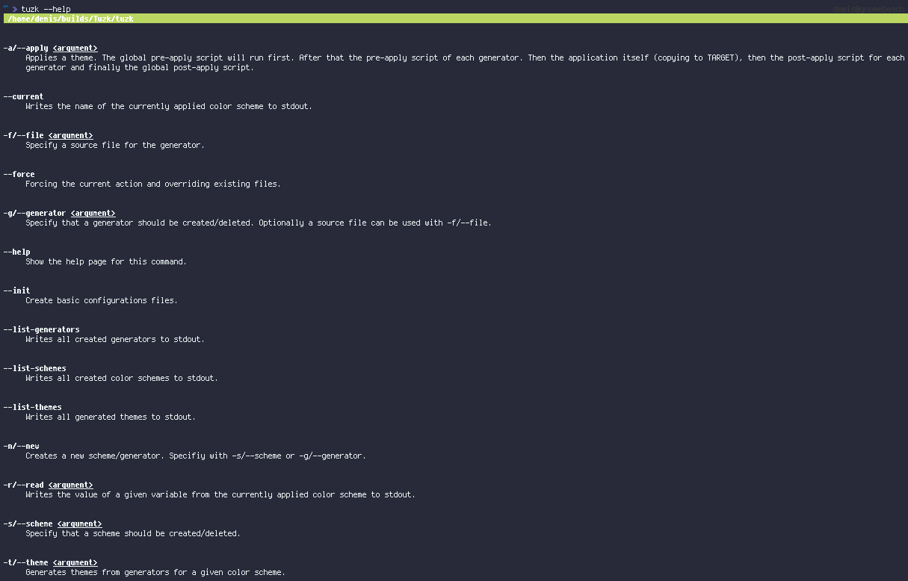

## Tuzk
Tuzk is a CLI color scheme and theme generator, applier and manager written in PHP.

### Inspiration
I have taken great inspiration from budlabs' [mondo](https://github.com/budlabs/mondo). Tuzk is similarly built and organized. Mondo is written in BASH however. I have written Tuzk because mondo was lacking a couple of featrues I wanted to have. All credit however goes to budrich. Without his application, I probably would have never started developing Tuzk.

#### Why PHP?
PHP is widely available on almost every linux machine. It's fast, lightweight and easy to maintain. Although Tuzk is written in PHP, you don't need to know any PHP to use it. Tuzk has built-in support for bash scripts. So the question you should really be asking is: Why not PHP?

#### Requirements
* PHP >= 7.0
* [Composer](https://getcomposer.org): Tuzk makes use of nategood's [commando](https://packagist.org/packages/nategood/commando) package. Therefore you need composer to be up and running. If you haven't used composer, take a look [here](https://getcomposer.org/doc/00-intro.md) to get a quick intro. It's quite easy. You may want to make composer [globally](https://getcomposer.org/doc/00-intro.md#globally) available as well.
* Git: if you choose to install it using git.

#### Installation
##### Via AUR
Coming soon.
##### Via Composer
Coming soon.
##### Via git
1. Clone this git repo anywhere on your machine. I suggest somewhere in your home directory. For example I have setup a directory `~/builds` for things like that. So you could do something like
`cd ~/builds && git clone https://github.com/minikN/Tuzk.git`.
2. `cd` into the created directory `cd Tuzk`.
3. Install the required composer dependencies by running `composer update`.

#### Accessing tuzk globally
There are many ways to achieve this.
* Using shell aliases: You could create a simple alias in your `.bashrc` or `.zshrc` file like so: `echo "alias tuzk=\"php ~/builds/Tuzk/tuzk\"" >> ~/.zshrc && source ~/.zshrc`. If you open a new terminal afterwards you should be able to write `tuzk --help` and see Tuzk's help menu. There are obviously many ways of doing this. Google is your friend.
* Using composer (coming soon): If you have installed Tuzk globally using composer you can add composers' `vendor/bin` directory to your PATH like so (assuming zsh): `echo "export PATH=~/.config/composer/vendor/bin:$PATH" >> ~/.zshrc && source ~/.zshrc`. After that you should be able to open a new terminal window and type `tuzk --help` to see the help menu.

### Schemes, themes and generators
Give me a couple of seconds to talk about those terms. You may confuse them when first using Tuzk, so let this be your guide of what is what.
* **Schemes**: Schemes (or color schemes) are simple text files in which you define a color palette and other variables optionally. Of course, you may use any existing color scheme you want, as long as you write it down in a format Tuzk can understand. We will shortly look at this in detail. Schemes are located in `~/.config/tuzk/schemes`.
* **Generators**: Generators are the bridge between color schemes and applications. A generator will create a theme based off a color scheme for a given application. It will read the variables you have defined in your scheme file and create a theme file off a template you have defined for said generator. Generators are located in `~/.config/tuzk/generators`.
* **Themes**: A theme is created by a generator after it has read your scheme file. Depening on the generator you wrote, it could (for example) be a `.tmTheme` file for sublime, a vim color scheme, a rofi theme or anything else. Themes are located in `~/.config/tuzk/generators/<name of generator>`.

By default Tuzk doesn't come with any schemes, themes or generators. It wouldn't make sense to include them. A generator for example is system specific. You need to tell it how your theme file should look like, where to copy it and what to run before and after application. That being said, I have my Tuzk config files publicly [available](https://github.com/minikN/i3-monokai/tree/master/files/.config/tuzk). Feel free to use them.

#### Initialisation & first steps
##### Initialisation
After you have access to the `tuzk` executable, there is one more thing you need to in order to get going. You need to initialize Tuzk.

You can do so by running `tuzk --init`. This will create all the necessary folders and files inside `~/config/tuzk`.

##### The help menu
In case you are lost, you can always run `tuzk --help` to get a handy help menu.

##### the --force flag
You can prepend pretty much every command with `--force`. This forces Tuzk to override any already created files. Use this with caution. For example, you could run `tuzk --init --force` to force a re-initialisation. This will override all configuration (color schemes, themes and generators) files you may have created before.

### Creating a scheme
Creating a scheme is the first thing you want to do. If you use Tuzk for the first time however, I'd suggest taking a look at the files inside `~/config/tuzk`. Open the whole folder in a text editor of your choice.

##### Scheme template
Firstly, take a look at `~/.config/tuzk/schemes/template`. You can edit the file to your liking. Tuzk will use this file as a, well template, whenever you create a new scheme. Ideally, you would define boilerplate variables you want ever color scheme to have. Let's say you know you want every scheme to have a `accent-color` variable. You could define it here to save some time writing it out manually after you created a scheme.

##### Scheme default
`~/.config/tuzk/schemes/default` is a file that contains variables you want to share across all schemes. It's ideal to define fonts for example. When creating a theme later, Tuzk will merge the variables in the default file with ones in the scheme file. If you define a variable in your scheme file that has already been the defined in the default file, the scheme file variable will take presidence.

##### Creating variables
First off, every line in a scheme file beginning with a `#` will be treated as a comment. Tuzk will parse all remaining lines, treating whatever comes before the **first whitespace** as the variable, and everything after it as the value. A whitespace may be a space, a tab or multiple spaces. to illustrate this:

* `hello world`: Variable `hello`, value `world`
* `this is my awesome var`: Variable `this`, value `is my awesome var`
* `another "example"`: Variable `another`, value `"example"`

You can also refer values to other variables:

    black #000000
    bg black

Variable: `black`, value `#000000`
Variable: `bg`, value `#000000`

##### Creating a scheme (finally)
You can create a new scheme with the `--new` and `--scheme` (or short `-ns`) flags. Tuzk expects a name to be given. Let's call it monokai.

    tuzk -ns monokai
    INFO: Generating scheme monokai in /home/user/.config/tuzk/schemes

After that you want to open `~/.config/tuzk/schemes/monokai` and replace all boilerplate values with the actual values you want. That's it, first step done. A finished scheme may look like [this](https://github.com/minikN/i3-monokai/blob/master/files/.config/tuzk/schemes/MonokaiPro).

### Creating a generator
Creating a generator is best explained using an actual application. So for this, let's say we want to create a generator for rofi. It will now become clear why it doesn't make sense to include my generators by default.

In my `~/.config/rofi` folder I have [three](https://github.com/minikN/i3-monokai/tree/master/files/.config/rofi) files. `menu.rasi` and `spotlight.rasi` are the actual themes. `globals.rasi` is the file where I define all colors for the themes. It looks like [this](https://github.com/minikN/i3-monokai/blob/master/files/.config/rofi/globals.rasi). In my theme files I would then include the colors like so: `@import "globals.rasi"`. That way I separated my colors from my themes. So in regards to Tuzk, the only file I really want to touch is `globals.rasi`.

You can create a new generator with the `--new` and `--generator` (or short `-ng`) flags. Tuzk expects a name to be given. Optionally you can pass the `--file` (`-f`) flag to specify a source file to start from.

With that in mind, I create my rofi generator like so:

    tuzk -ng rofi -f ~/.config/rofi/globals.rasi
    INFO: Created /home/user/.config/tuzk/generators/rofi

Now take a look at `~/.config/tuzk/generators/rofi`. Couple of new files here. The `rofi_pre` and `rofi_post` files are simple bash scripts that will be executed before and after the theme has been applied. Need to move, create or delete some files before or after the theme has been applied? Put it in `rofi_post` or `rofi_pre` (You can access all theme values [colors, name, ...] inside the bash script. Take a look at the lists and read section to find out how).

Open `~/.config/tuzk/generators/rofi/rofi_settings`. If you specified a source file with the `-f/--file` flag, the target variable will be set to that file. If you apply a theme later, Tuzk will copy the generated theme to that path (and override any existing file in the process). If you don't want this, simply comment the line out. The `mode` will be set to `hex` by default. Read the mode section to find out what it's about.

Now open `~/.config/tuzk/generators/rofi/rofi_template`. If you specified a file, this will be a carbon copy of that file. If not, it will be a blank file. Be sure not to add any comments to this file. If you have specified a target, the file will be copied to its target destination. Unwanted comments may cause parsing issue with the target application.

In this file you want to replace every value with a placeholder containing the name of the variable you want to replace it with surrounded by two `%` symbols. So in case of our rofi example, we want to replace the line
`bg: #000000;` with `bg: %%bg%%;`. When creating a theme, Tuzk will read that placeholder and replace it with whatever you specified in your color scheme. After doing that to all lines our rofi theme file should look like this:

    * {
        /* These variables get changed automatically through
        * the shell script.
        */

        bg: %%bg%%;
        grey: %%grey%%;
        grey-dark: %%grey-dark%%;
        grey-bright: %%grey-bright%%;
        fg: %%fg%%;
        fg-dark: %%fg-dark%%;
        fg-bright: %%fg-bright%%;
        fg-white: %%fg-white%%;
        contrast: %%contrast%%;
        contrast-dark: %%contrast-dark%%;
        contrast-darker: %%contrast-darker%%;
        red: %%red%%;
        yellow: %%yellow%%;
        green: %%green%%;
        purple: %%purple%%;
        orange: %%orange%%;
        cyan: %%cyan%%;
        accent: %%accent%%;
        highlight: bold %%yellow%%;
        font-rofi: "%%font%% %%fontsize1%%";
        mono-rofi: "%%font2%% %%fontsize2%%";
    }

Notice the last two lines, don't forget to use variables defined in the `default` file if you have default values.

### Creating a theme
You are now ready to create a theme. We want to create a theme based off the monokai scheme we created earlier.

    tuzk -t monokai
    INFO: Generating theme monokai for rofi.

Tuzk will loop through every generator and create the theme. In this case we only have rofi.
Check the file `~/.config/tuzk/generators/rofi/monokai`. It replaced all the placeholders with the values from the scheme file.

### Applying a theme
The last step is to apply a theme.

    tuzk -a monokai
    INFO: Setting current scheme to monokai.
    INFO: Created /home/user/.config/tuzk/schemes/current
    INFO: Running global pre apply script.
    INFO: Running rofi pre apply script.
    INFO: Copying monokai for rofi to /home/user/.config/rofi/globals.rasi
    INFO: Running rofi post apply script.
    INFO: Running global post apply script.
    INFO: Everything done.

Tuzk will copy the current theme to `/home/user/.config/tuzk/schemes/current`. You don't need to worry about it, but Tuzk needs that file for other operations. In `~/.config/tuzk` there is a `global_pre` and `global_post` file. Both are bash script. The pre apply script will be run before the theme is applied to any application. The generator specific pre and post script are run before / after the theme is applied to each application. The global post apply script is run after everything else is done. If you specified any targets, Tuzk will let you know what it copied.

### Read values and lists
Tuzk comes with a couple of handy functions to read variables of the currently applied theme as well as some list functions

With `-r/--read` you can read a specific variable and Tuzk will write it to stdout.

    tuzk -r bg
    #2d2a2e

With that you can also refer to variables of the currently applied theme in the bash scripts.

With `--current` you can read the currently applied theme.

    tuzk --current
    monokai

With `--list-schemes`, `--list-themes` and `--list-generators` you can list all available schemes, themes and generators.

    tuzk --list-schemes
    monokai
    gruvbox
    solarized

    tuzk --list-generators
    rofi
    vim
    sublime
    xresources

